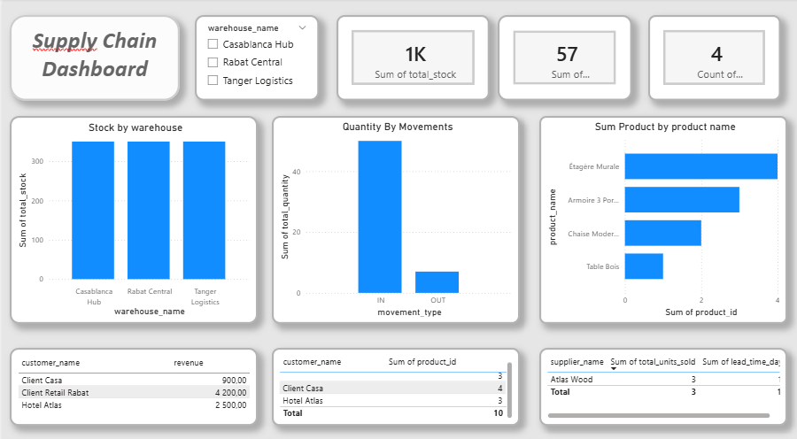

# Supply Chain Analytics Project (PostgreSQL + Power BI)

## 📌 Project Overview
End-to-end supply chain analytics project using PostgreSQL and Power BI.
The project focuses on stock management, sales performance, and risk monitoring.

---

## 🗄️ Database Design
Tables included:
- warehouses
- suppliers
- products
- customers
- inventory
- orders
- order_items
- stock_movements

---

## 📊 SQL Analysis
Business logic implemented using SQL views:
- Stock by warehouse
- Revenue by product
- Customer revenue analysis
- Low stock alerts
- Supplier risk analysis

SQL scripts are available in the `/sql` folder.

---

## 📈 Power BI Dashboard
The dashboard is built using PostgreSQL views and includes:
- KPIs
- Stock distribution
- Revenue analysis
- Risk indicators

---

## 🧠 Tools & Technologies
- PostgreSQL
- pgAdmin
- SQL
- Power BI
- VS Code
- GitHub

---

## 🚀 How to Run
1. Execute `01_schema.sql`
2. Execute `02_insert_data.sql`
3. Execute `03_analysis.sql`
4. Open Power BI file and connect to PostgreSQL

---

## 👤 Author
Fatima Jouiry
