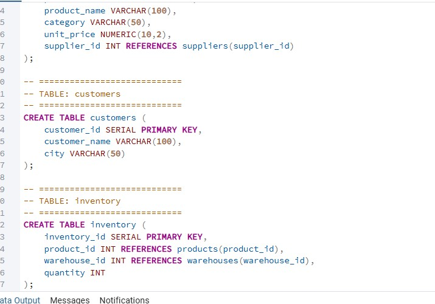
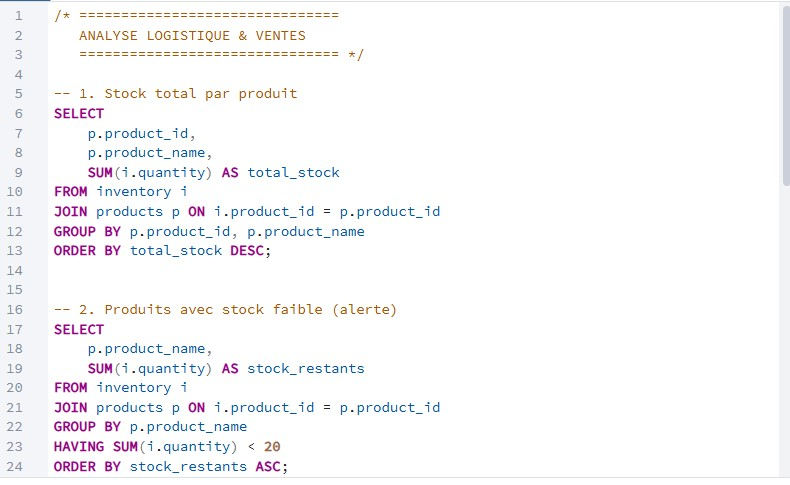

# 📦 Supply Chain Analytics Project (PostgreSQL + Power BI)

## 🚀 Project Overview
This professional project focuses on stock management, sales performance, and supply chain risk monitoring. It demonstrates an end-to-end data workflow, from relational database design to executive-level visualization.

## 📊 Interactive Dashboard
The Power BI dashboard provides real-time monitoring of inventory levels and warehouse performance.

## 🗄️ Database Design & SQL Logic
The system is built on a PostgreSQL database containing tables for warehouses, suppliers, products, and movements.

### Business Logic Implementation
I developed custom SQL views to automate key supply chain metrics:
- **Inventory Monitoring:** Tracking stock by warehouse.
- **Risk Analysis:** Identification of low-stock alerts.
- **Supplier Performance:** Monitoring lead times and delivery reliability.

### SQL Evidence (Technical Documentation)
Below are the technical queries and schemas developed during the analysis phase:

**1. Schema & Table Structure:**

**2. Data Insertion & Validation:**

**3. Advanced Performance Analysis:**

## 🛠️ Tools & Technologies
- **PostgreSQL & pgAdmin:** Database management and hosting.
- **SQL:** Complex queries, VIEWs creation, and data cleaning.
- **Power BI:** Interactive data visualization and KPI tracking.
- **VS Code & GitHub:** Version control and project documentation.

## 📁 How to Run
1. Execute `sql/01_schema.sql` to create the structure.
2. Execute `sql/02_insert_data.sql` to populate the database.
3. Execute `sql/03_analysis.sql` to generate performance views.
4. Open the Power BI file and refresh the data connection.

---
*Professional Portfolio Project - Logistics Management*
